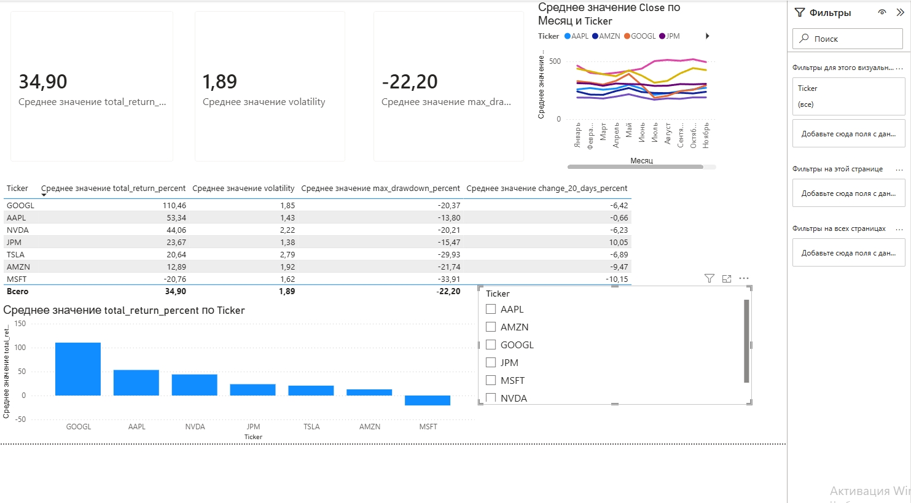

# Анализ акций американского рынка (Stock Market Analysis)

## Описание проекта
Проект посвящен анализу 7 акций американского рынка (AAPL, AMZN, GOOGL, JPM, MSFT, NVDA, TSLA) за последний год.  
**Цель** — оценить доходность, риск и текущий тренд каждой акции, чтобы понять, какие бумаги выглядят привлекательнее для инвестора.

## Используемые инструменты
- **Python (yfinance)** — сбор исторических данных по акциям  
- **SQLite** — написание аналитических запросов  
- **Power BI** — создание интерактивного дашборда  
- **Git** — контроль версий и портфолио

## Ключевые выводы
1. **Лучшая доходность:** GOOGL (+110% за год).  
2. **Самая стабильная:** JPM (низкая волатильность и небольшая просадка).  
3. **Самая рискованная:** TSLA (высокая волатильность и глубокая просадка).  
4. **Единственная убыточная акция:** MSFT (-21% за год).  
5. **Краткосрочный тренд:** JPM показывает рост за последние 20 дней (+10%), MSFT и AMZN продолжают снижаться.

## Дашборд в Power BI


## Структура проекта
```text
stock_market_analysis/
├── data/                  # Исходные данные (CSV)
├── sql/                   # SQL-запросы
├── results/               # Результаты запросов (CSV)
├── dashboard/             # Файл .pbix и скриншот
├── insights/              # Бизнес-выводы
└── README.md              # Описание проекта
